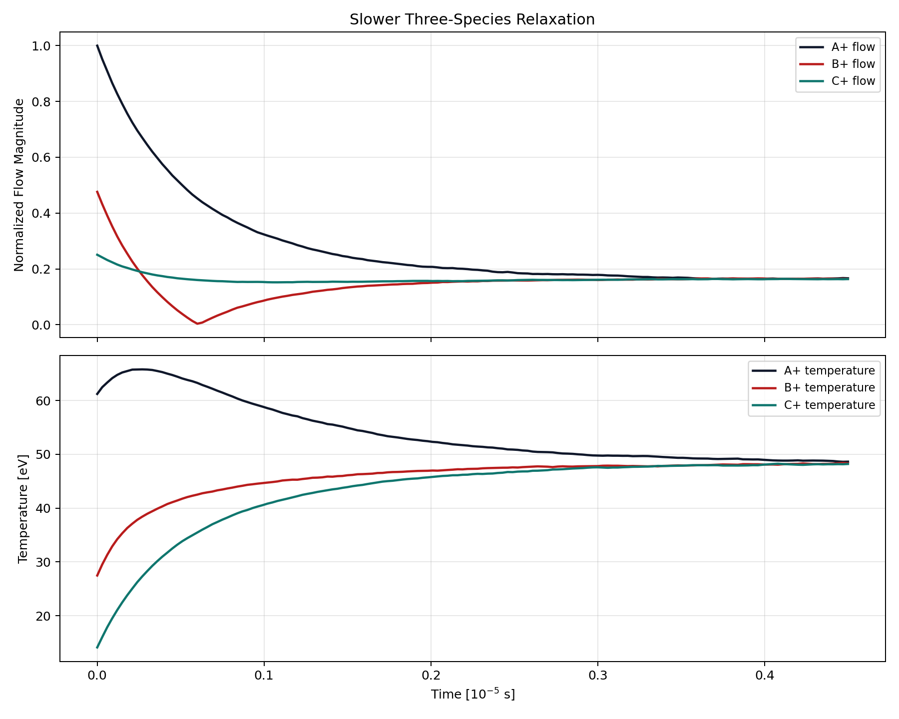
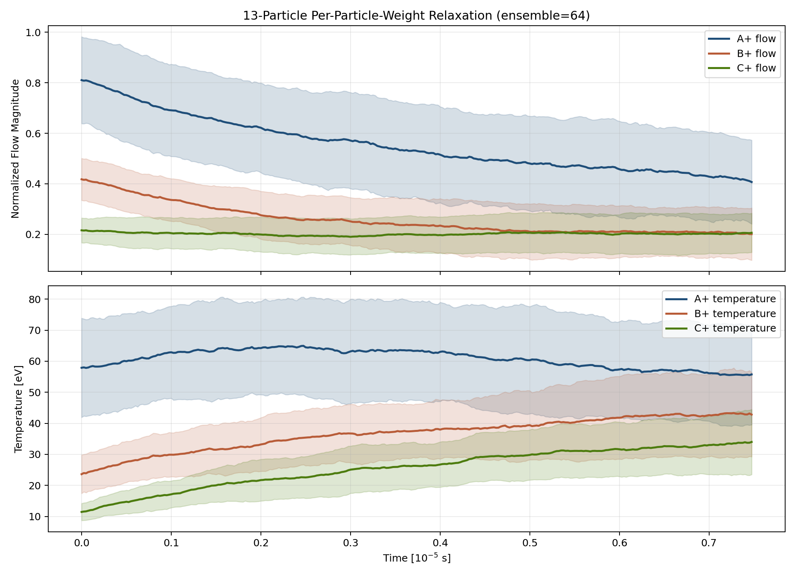

# Binary Collision Operator

A **Monte Carlo Binary Collision Operator** for Coulomb collisions in plasmas, directly based on:

- **Nanbu (1997)**: _Theory of cumulative small-angle collisions in plasmas_
- **Nanbu & Yonemura (1998)**: _Weighted Particles in Coulomb Collision Simulations_

This library provides a simple Python implementation of the binary collision method as described in the above papers. It supports **equally weighted and un-equally weighted particles**, and focuses on reproducing the original theoretical model. The implementation is intended for verification, or integration into research codes where Nanbu’s method is specifically required.

---

## Features

- Monte Carlo operator using **cumulative deflection angle theory**
- Automatically supports:
  - **Equal & unequal weights**
  - **Per-particle weights**
  - **Same-species and cross-species collisions**
  - **Velocity-dependent collision rates**
- Includes a separate **`MultiSpeciesCollision`** orchestrator for **3+ species** without changing the original two-species `Collision` API
- Includes **a sample script** reproducing key figures from Nanbu & Yonemura (1998)

---

## Project Structure

```
binary-coulomb-collision/  
├── binary_collision/    
│   ├── __init__.py  
│   ├── collision.py  
│   └── particle.py  
├── examples/                
│   ├── basic_run.py  
│   └── nanbu_relaxation_demo.py  
├── tests/                 
├── utilities/                 
│   ├── __init__.py  
│   └── flow_temp_relaxation.py
├── LICENSE  
├── setup.py  
└── README.md
```

---

## Getting Started

### Installation
To use this library, you will need **Python 3.10+** along with the following dependencies:

- `numpy`
- `scipy`  

To install:

```bash
git clone https://github.com/UNIST-FPL/binary-coulomb-collision.git
cd binary-coulomb-collision
pip install -e .
```

For development and testing:

```bash
pip install -e ".[dev]"
pytest -q -m "not verification"
pytest -m verification -q
python scripts/generate_baselines.py
python scripts/generate_multispecies_baselines.py
python scripts/diff_baselines.py tests/data /path/to/new/baselines
python scripts/main_compatibility_report.py
```

See [TESTING.md](TESTING.md) for the baseline update policy and the intended test workflow.
See [CONTRIBUTING.md](CONTRIBUTING.md) for the recommended branch and PR workflow.

---

## Basic Usage

This library now exposes three practical usage modes:

- `Particle`: species container for marker velocities and moments
- `Collision`: original two-species operator, kept API-compatible
- `MultiSpeciesCollision`: 3+ species orchestrator built on top of the tested pairwise `Collision` kernel

The key backward-compatibility rule is unchanged:

- existing two-species code should continue to use `Particle(...)` + `Collision(...)`
- 3+ species should use `Particle(...)` + `MultiSpeciesCollision(...)`
- the meaning of `Particle`, `Collision.run()`, and `Collision.get_velocity()` is unchanged

### 1. Two-Species API

This is the original public interface and remains the correct entry point for codes such as D3C-K that already call the library in the two-species form.

Here is a minimal usage pattern:

```python
from binary_collision import Particle, Collision

# Define two species.
# If `vel` is omitted, the code samples an isotropic Maxwellian from
# `flow` and `temperature`.
D = Particle(
    name="D+",
    charge=1,
    mass=2.0141,
    density=1.0e20,
    flow=0.0,
    temperature=10.0,
    Nmarker=1000,
    weight=1.0e17,
)
e = Particle(
    name="e-",
    charge=-1,
    mass=5.48579909065e-4,
    density=1.0e20,
    flow=2.0e5,
    temperature=100.0,
    Nmarker=1000,
    weight=1.0e17,
)

# Create the operator for one physical timestep.
col = Collision(D, e, dtp=1e-7)

# Optional: inspect velocities before the step.
v_D_before, v_e_before = col.get_velocity()

# Apply one Nanbu collision step.
col.run()

# Velocities and species moments are updated in place.
v_D_after, v_e_after = col.get_velocity()
print(D.flow_actual, D.temperature_actual)
print(e.flow_actual, e.temperature_actual)
```

For a two-species `Collision`, one `run()` call performs:

- self-collision for species A
- self-collision for species B
- unlike collision for A-B

with randomized stage order, matching the library's original behavior.

### 2. Three or More Species

For 3+ species, use `MultiSpeciesCollision`. This does not replace the original `Collision` class. It adds a higher-level scheduler that applies all like and unlike species-pair stages during one system timestep.

Example:

```python
from binary_collision import Particle, MultiSpeciesCollision

species = [
    Particle(
        name="e-",
        charge=-1,
        mass=5.48579909065e-4,
        density=9.0e20,
        flow=3.0e5,
        temperature=650.0,
        Nmarker=18,
        weight=9.0e20 / 18,
    ),
    Particle(
        name="D+",
        charge=1,
        mass=2.0141,
        density=9.0e20,
        flow=-1.6e5,
        temperature=130.0,
        Nmarker=18,
        weight=9.0e20 / 18,
    ),
    Particle(
        name="He+",
        charge=1,
        mass=4.0026,
        density=9.0e20,
        flow=8.0e4,
        temperature=45.0,
        Nmarker=18,
        weight=9.0e20 / 18,
    ),
]

col = MultiSpeciesCollision(species, dtp=5.0e-9)
col.run()  # one full multi-species timestep

for part in species:
    print(part.name, part.flow_actual, part.temperature_actual)
```

`MultiSpeciesCollision` builds one timestep from all required stages:

- like: `a-a`, `b-b`, `c-c`, ...
- unlike: `a-b`, `a-c`, `b-c`, ...

The stage execution order is randomized each timestep, while the underlying pairwise scattering kernel remains the same tested `Collision` implementation used by the two-species path.

Current 3+ species scope:

- keeps the original two-species `Collision` API unchanged
- uses the tested pairwise `Collision` kernel as the building block
- supports species-level scalar weights
- supports per-particle weights
- includes deterministic 3-species regression baselines and verification cases

### 3. Per-Particle Weights

The `Particle.weight` field can now be either:

- a scalar: one statistical weight shared by all markers in the species
- a `numpy.ndarray` of shape `(Nmarker,)`: one weight per marker

This is the public entry point for the per-particle-weight algorithm from Nanbu and Yonemura (1998).

The required usage rule is:

- `Nmarker` must equal `len(weight_array)`
- `density` should be the total represented real-particle density, which in the current implementation should match `weight_array.sum()`

Example:

```python
import numpy as np
from binary_collision import Particle, MultiSpeciesCollision

weight_A = np.array([1.03, 1.37, 1.91, 2.29, 2.83, 3.47, 4.19, 5.02, 5.91, 6.88, 7.97, 9.11, 10.37]) * 1.0e18
weight_B = np.array([1.21, 1.49, 1.88, 2.36, 2.95, 3.61, 4.33, 5.14, 6.05, 7.09, 8.17, 9.43, 10.81]) * 1.0e18
weight_C = np.array([1.12, 1.58, 1.99, 2.47, 3.08, 3.73, 4.51, 5.28, 6.22, 7.21, 8.39, 9.62, 11.03]) * 1.0e18

species = [
    Particle(
        name="A+",
        charge=1,
        mass=1.7,
        density=float(weight_A.sum()),
        flow=8.0e4,
        temperature=62.0,
        Nmarker=len(weight_A),
        weight=weight_A,
    ),
    Particle(
        name="B+",
        charge=1,
        mass=2.7,
        density=float(weight_B.sum()),
        flow=-4.0e4,
        temperature=26.0,
        Nmarker=len(weight_B),
        weight=weight_B,
    ),
    Particle(
        name="C+",
        charge=1,
        mass=4.1,
        density=float(weight_C.sum()),
        flow=2.0e4,
        temperature=12.0,
        Nmarker=len(weight_C),
        weight=weight_C,
    ),
]

col = MultiSpeciesCollision(species, dtp=2.5e-8)
for _ in range(300):
    col.run()
```

This path is tested by:

- deterministic exact regression for small 2-species and 3-species per-particle-weight cases
- ensemble verification for a 13-marker, all-different-weight slow relaxation case

### 4. Diagnostics and Relaxation Histories

For scripted verification or plotting, the utilities layer exposes deterministic helpers:

```python
from utilities import (
    simulate_relaxation,
    simulate_relaxation_multispecies,
    simulate_relaxation_multispecies_ensemble,
)
```

Available helpers:

- `simulate_relaxation(particle_dict1, particle_dict2, iterations, dt, rng=...)`
  - two-species history arrays
- `simulate_relaxation_multispecies(particle_dicts, iterations, dt, rng=...)`
  - one seeded 3+ species history
- `simulate_relaxation_multispecies_ensemble(particle_dicts, iterations, dt, base_seed, ensemble_size)`
  - ensemble mean/std histories, useful when a very small marker count makes a single run too noisy

The returned dictionaries contain:

- `species_names`
- `flow_histories`
- `flow_magnitudes`
- `temperature_histories`
- `time_axis`
- `reference_flow`

For the ensemble helper, mean/std fields are returned instead:

- `flow_histories_mean`, `flow_histories_std`
- `flow_magnitudes_mean`, `flow_magnitudes_std`
- `temperature_histories_mean`, `temperature_histories_std`
- `ensemble_size`

### 5. Reproducing the 13-Particle Per-Particle-Weight Plot

The repository includes a deliberately small but smooth per-particle-weight demonstration that uses 13 markers per species with all-different weights and renders an ensemble-averaged relaxation plot.

Run:

```bash
python scripts/render_thirteen_particle_weight_case.py
```

This writes:

- `artifacts/multispecies_figures/thirteen_particle_weight_relaxation.png`

The figure is ensemble-averaged on purpose. A single 13-marker Monte Carlo realization is physically valid but visibly noisy; the stored plot is intended to show the slow relaxation trend clearly.

### 6. Ready-Made Canonical Cases

Reusable case definitions live in:

- `utilities/nanbu_figure_cases.py`
- `utilities/multispecies_cases.py`

Examples include:

- `canonical_three_species_case()`
- `canonical_three_species_weighted_case()`
- `three_species_long_time_equilibrium_case()`
- `three_species_slower_relaxation_case()`
- `particle_weight_two_species_case()`
- `particle_weight_three_species_case()`
- `thirteen_particle_weight_relaxation_case()`

> For fully working examples with realistic parameters and diagnostic output, see:
> - [`examples/basic_run.py`](examples/basic_run.py)
> - [`examples/nanbu_relaxation_demo.py`](examples/nanbu_relaxation_demo.py)
>
> The figure example and the verification tests both use the shared canonical case definitions in `utilities/nanbu_figure_cases.py`.
> The default figure baselines are generated at the original `main` scale, not the reduced test scale.
> The stored full-scale PNG snapshots rendered from those seeded baselines are kept for manual inspection; the automated regression check uses the seeded numerical histories.

### 7. Practical Notes

- If `vel` is not provided, `Particle` initializes an isotropic Maxwellian using `flow` and `temperature`.
- Two-species compatibility is intentionally preserved. Existing code that calls `Collision(spa, spb, dtp=...)` does not need to be rewritten for the 3+ species work.
- Per-particle weights are supported for both the two-species `Collision` path and the `MultiSpeciesCollision` path.
- For very small marker counts, use ensemble averaging for visualization if you want smooth curves. The single realization is the exact Monte Carlo run; the ensemble average is just a cleaner diagnostic.

## Verification Results

The automated acceptance criterion in this repository is numerical history matching, not image matching. The figures below are included in the README because they make the verification targets easier to interpret.

### 3-Species Slow Relaxation

This is the 3-species example that should be used as the representative README case. It was chosen specifically so that relaxation is gradual enough to read directly from the plot, instead of collapsing too quickly into the final state.



What this figure is meant to show:

- all three species relax toward a common flow magnitude
- all three species relax toward a common temperature
- the approach to equilibrium is slow enough that the transient relaxation is clearly visible

The corresponding case definition is `three_species_slower_relaxation_case()` in `utilities/multispecies_cases.py`.

### 13-Particle Per-Particle-Weight Relaxation

This is the smallest intentionally nontrivial per-particle-weight case currently documented in the repository. Each of the three species has exactly 13 markers, and every marker has a different statistical weight.

Because a single 13-marker Monte Carlo realization is noisy, the README figure uses the ensemble helper and plots the ensemble mean with spread bands.



What this figure is meant to show:

- the per-particle-weight algorithm runs in the same `MultiSpeciesCollision` framework as the scalar-weight case
- even with only 13 markers per species, the ensemble-averaged result shows a clear slow relaxation trend
- the weighted multi-species path is suitable for verification, not just for one-off smoke tests

The case definition is `thirteen_particle_weight_relaxation_case()` and the rendering script is `scripts/render_thirteen_particle_weight_case.py`.
The automated verification for this path is in `tests/test_particle_weight_verification.py`.

---

## Verification Scripts

Figures correspond to **Nanbu & Yonemura (1998), JCP Fig. 4–6**.

### Fig. 4 – Relaxation of temperature and flow (W_D = 5 W_e)  


**Fig. 4** – Relaxation of temperature and bulk flow velocity for electrons (e⁻) and deuterium ions (D⁺).  
This reproduces the behavior shown in Nanbu & Yonemura (1998, Fig. 4).  
This case uses a weight ratio of **W_D = 5 W_e**.

---

### Fig. 5 – Relaxation of temperature and flow (W_e = 5 W_D)  


**Fig. 5** – Relaxation of temperature and bulk flow velocity for electrons (e⁻) and deuterium ions (D⁺).
This reproduces the behavior shown in Nanbu & Yonemura (1998, Fig. 5).  
In this case, electrons have higher weight: **W_e = 5 W_D**.

---

### Fig. 6 – Relaxation with Z=3 and W_e = 3 W_D  


**Fig. 6** – Relaxation behavior for multi-weight species where D⁺ has charge **Z = 3** and the weight ratio is **W_e = 3 W_D**.  
This corresponds to Fig. 6 in Nanbu & Yonemura (1998), and verifies proper handling of charge scaling and weighted marker exchange.

---

## References

- K. Nanbu, [Phys. Rev. E 55, 4642 (1997)](https://doi.org/10.1103/PhysRevE.55.4642)
- K. Nanbu and S. Yonemura, [J. Comput. Phys. 145, 639 (1998)](https://doi.org/10.1006/jcph.1998.6049)

---

## License

This project is licensed under the **BSD 3-Clause License** – see the [LICENSE](LICENSE) file for details.

---

## Contributions

Issues, bug reports, and pull requests are welcome!  
For questions or discussion, contact: **sungpil.yum [at] unist.ac.kr**
