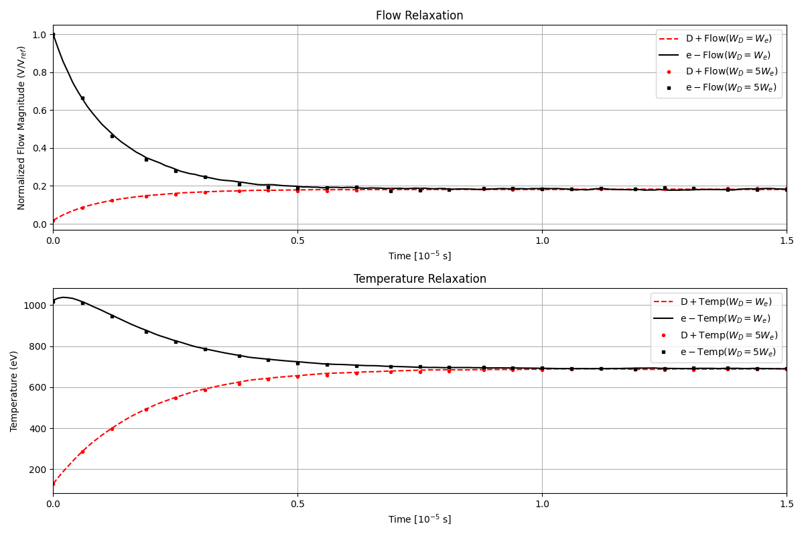
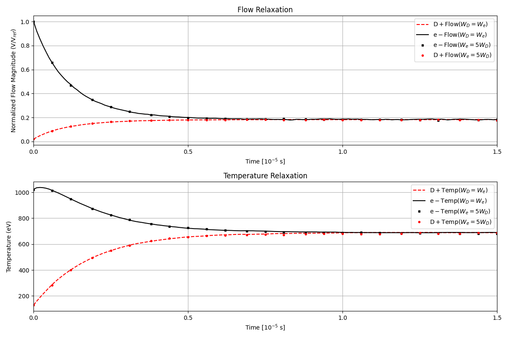
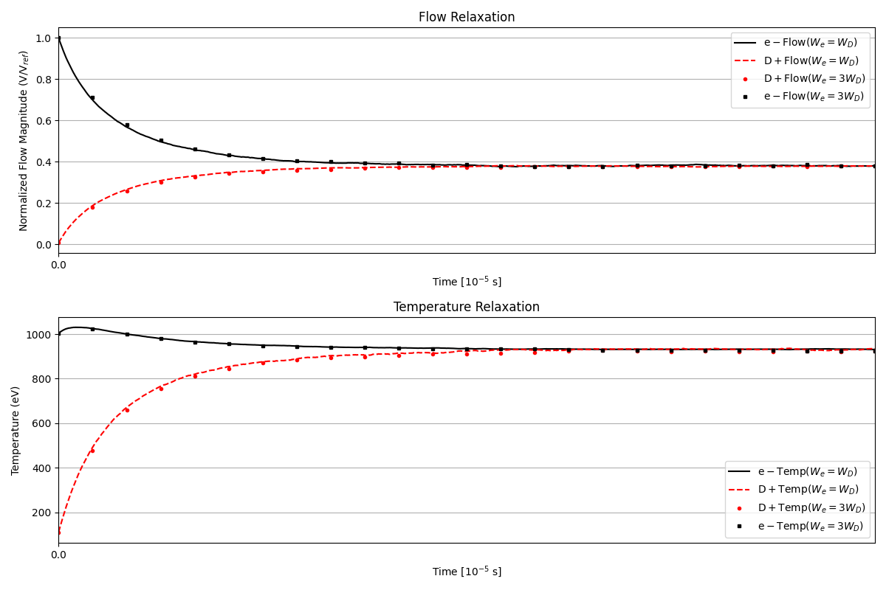

# Binary Collision Operator

A **Monte Carlo Binary Collision Operator** for Coulomb collisions in plasmas, directly based on:

- **Nanbu (1997)**: _Theory of cumulative small-angle collisions in plasmas_
- **Nanbu & Yonemura (1998)**: _Weighted Particles in Coulomb Collision Simulations_

This library provides a simple Python implementation of the binary collision method as described in the above papers. It supports **equally weighted and un-equally weighted particles**, and focuses on reproducing the original theoretical model. The implementation is intended for verification, or integration into research codes where Nanbu’s method is specifically required.

---

## Features

- Monte Carlo operator using **cumulative deflection angle theory**
- Automatically supports:
  - **Equal & unequal weights**
  - **Same-species and cross-species collisions**
  - **Velocity-dependent collision rates**
- Includes **a sample script** reproducing key figures from Nanbu & Yonemura (1998)

---

## Project Structure

```
binary-coulomb-collision/  
├── binary_collision/    
│   ├── __init__.py  
│   ├── collision.py  
│   └── particle.py  
├── examples/                
│   ├── basic_run.py  
│   └── nanbu_relaxation_demo.py  
├── tests/                 
├── utilities/                 
│   ├── __init__.py  
│   └── flow_temp_relaxation.py
├── LICENSE  
├── setup.py  
└── README.md
```

---

## Getting Started

### Installation
To use this library, you will need **Python 3.10+** along with the following dependencies:

- `numpy`
- `scipy`  

To install:

```bash
git clone https://github.com/UNIST-FPL/binary-coulomb-collision.git
cd binary-coulomb-collision
pip install -e .
```

For development and testing:

```bash
pip install -e ".[dev]"
pytest -q -m "not verification"
pytest -m verification -q
python scripts/generate_baselines.py
python scripts/diff_baselines.py tests/data /path/to/new/baselines
```

See [TESTING.md](TESTING.md) for the baseline update policy and the intended test workflow.

---

## 🔧 Basic Usage

This library provides two main interfaces:

- `Particle`: defines a particle species (mass, charge, temperature, velocity, weight, etc.)
- `Collision`: manages Coulomb binary collisions between two `Particle` objects using Nanbu's cumulative-angle method.

Here is a minimal usage pattern:

```python
from binary_collision import Particle, Collision

# Define species
D = Particle(...)    # e.g., D+ ion parameters
e = Particle(...)    # e.g., electron parameters

# Create collision operator
col = Collision(D, e, dtp=1e-7)  # dtp = time step in seconds

# Run one Monte Carlo collision step
col.run()
```

This will apply both like-species (D–D, e–e) and unlike-species (D–e) collisions for one time step.

> For fully working examples with realistic parameters and diagnostic output, see:
> - [`examples/basic_run.py`](examples/basic_run.py)
> - [`examples/nanbu_relaxation_demo.py`](examples/nanbu_relaxation_demo.py)

---

## Verification Scripts

Figures correspond to **Nanbu & Yonemura (1998), JCP Fig. 4–6**.

### Fig. 4 – Relaxation of temperature and flow (W_D = 5 W_e)  


**Fig. 4** – Relaxation of temperature and bulk flow velocity for electrons (e⁻) and deuterium ions (D⁺).  
This reproduces the behavior shown in Nanbu & Yonemura (1998, Fig. 4).  
This case uses a weight ratio of **W_D = 5 W_e**.

---

### Fig. 5 – Relaxation of temperature and flow (W_e = 5 W_D)  


**Fig. 5** – Relaxation of temperature and bulk flow velocity for electrons (e⁻) and deuterium ions (D⁺).
This reproduces the behavior shown in Nanbu & Yonemura (1998, Fig. 5).  
In this case, electrons have higher weight: **W_e = 5 W_D**.

---

### Fig. 6 – Relaxation with Z=3 and W_e = 3 W_D  


**Fig. 6** – Relaxation behavior for multi-weight species where D⁺ has charge **Z = 3** and the weight ratio is **W_e = 3 W_D**.  
This corresponds to Fig. 6 in Nanbu & Yonemura (1998), and verifies proper handling of charge scaling and weighted marker exchange.

---

## References

- K. Nanbu, [Phys. Rev. E 55, 4642 (1997)](https://doi.org/10.1103/PhysRevE.55.4642)
- K. Nanbu and S. Yonemura, [J. Comput. Phys. 145, 639 (1998)](https://doi.org/10.1006/jcph.1998.6049)

---

## License

This project is licensed under the **BSD 3-Clause License** – see the [LICENSE](LICENSE) file for details.

---

## Contributions

Issues, bug reports, and pull requests are welcome!  
For questions or discussion, contact: **sungpil.yum [at] unist.ac.kr**
